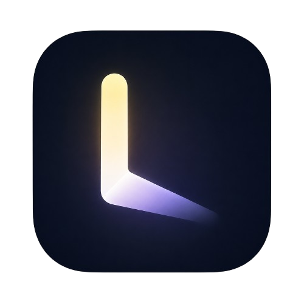
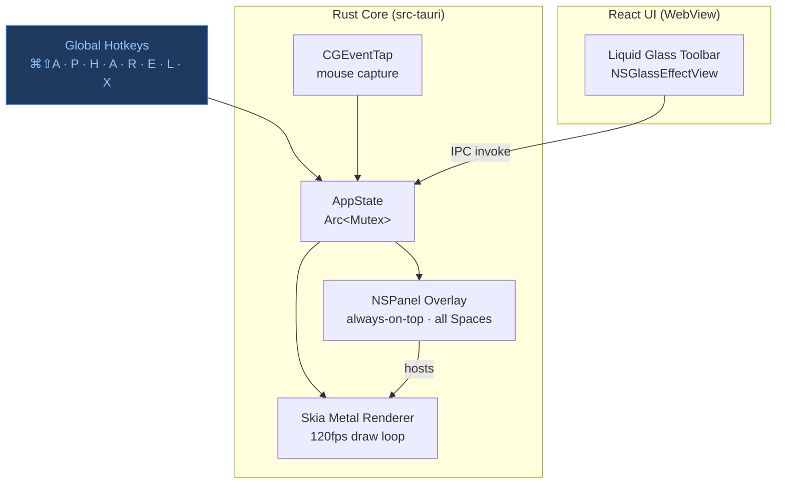

<p align="center">
  
</p>

<h1 align="center">Lumos</h1>

<p align="center"><strong>Native macOS screen annotation for live demos, presentations, and teaching.</strong></p>

<p align="center">
  
  
  
  
  
  
  
</p>

---

Lumos is a lightweight, keyboard-first macOS annotation overlay built for presenters and educators. Draw, highlight, and focus attention on your screen — then get out of the way — without ever leaving your flow.

## Features

| Feature | Detail |
|---------|--------|
| **Annotation tools** | Pen, Highlighter, Arrow, Rectangle, Ellipse, Laser, Eraser |
| **Cursor effects** | Glow, Ring, Pulse, Click ripple |
| **Spotlight mode** | Dim the screen, focus on what matters (circle or rectangle) |
| **Zoom lens** | Smooth cursor-following magnifier |
| **Liquid Glass toolbar** | Native `NSGlassEffectView` — Apple's macOS 26 material |
| **Click-through overlay** | Annotate and interact with apps simultaneously |
| **Global hotkeys** | Activate from any app, no context switch |
| **Multi-monitor** | Correct DPI handling across all connected displays |
| **120fps Skia rendering** | Metal-backed, Retina-correct annotation canvas |
| **Persistent settings** | Position, colors, and widths remembered between sessions |

## Architecture



## Hotkeys

| Action | Shortcut |
|--------|----------|
| Toggle annotation overlay | `⌘ ⇧ A` |
| Switch draw / pointer mode | `⌘ D` |
| Clear all annotations | `⌘ K` |
| Undo last stroke | `⌘ Z` |
| Pen | `P` |
| Highlighter | `H` |
| Arrow | `A` |
| Rectangle | `R` |
| Ellipse | `E` |
| Laser pointer | `L` |
| Eraser | `X` |
| Spotlight mode | `⇧ S` |
| Zoom lens | `⇧ Z` |

## Installation

**Homebrew (recommended):**
```bash
brew tap heza-ru/lumos https://github.com/heza-ru/Lumos
brew install --cask lumos
```

**Manual:** Download the latest DMG from [Releases](https://github.com/heza-ru/Lumos/releases/latest) and drag to Applications.

Grant **Accessibility** permission when prompted — required for the global hotkey overlay and mouse capture in draw mode.

## Building from source

**Requirements:** Rust 1.78+, Node 22+, pnpm 9+, macOS 13+

```bash
git clone https://github.com/heza-ru/Lumos
cd Lumos
pnpm install
pnpm tauri build
```

The DMG is output to `src-tauri/target/release/bundle/dmg/`.

For development:
```bash
pnpm tauri dev
```

## Tech stack

| Layer | Technology |
|-------|------------|
| Window + native APIs | [Tauri 2](https://tauri.app) + Rust |
| Annotation rendering | [Skia](https://skia.org) via `skia-safe` (Metal backend) |
| Glass material | [`NSGlassEffectView`](https://developer.apple.com/documentation/appkit/nsglasseffectview) via `tauri-plugin-liquid-glass` |
| Input capture | macOS `CGEventTap` |
| UI | React 18 + TypeScript 5 + [Lucide](https://lucide.dev) icons |
| Build | Vite 6 + `@tauri-apps/cli` |

## Contributing

Issues and PRs welcome. Please read [CONTRIBUTING.md](CONTRIBUTING.md) first.

## License

MIT — see [LICENSE](LICENSE).
