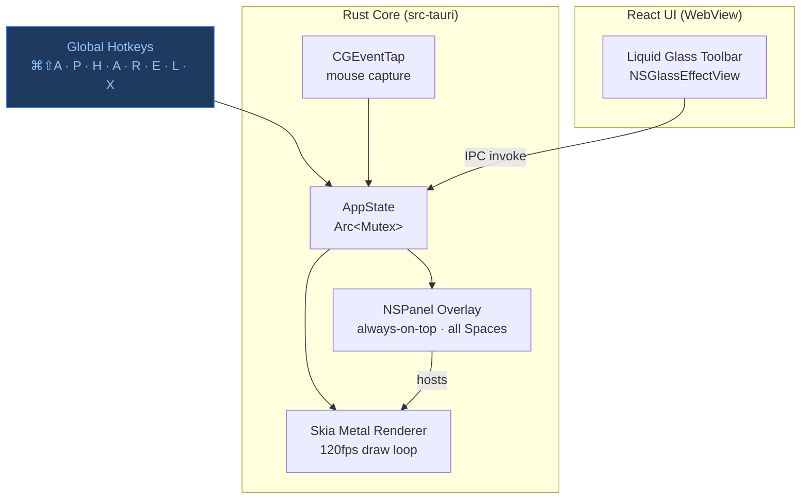

# Lumos UI/UX Redesign Implementation Plan

> **For agentic workers:** REQUIRED SUB-SKILL: Use superpowers:subagent-driven-development (recommended) or superpowers:executing-plans to implement this plan task-by-task. Steps use checkbox (`- [ ]`) syntax for tracking.

**Goal:** Replace the emoji-based placeholder toolbar with a production-grade Liquid Glass pill toolbar (Lucide icons, grouped controls, native NSGlassEffectView) and rewrite the README with Lumos branding, badges, and architecture diagram.

**Architecture:** `tauri-plugin-liquid-glass` applies `NSGlassEffectView` to the toolbar window; the React webview is fully transparent and renders only interactive elements on top. All CSS glass simulation is removed — the OS Metal compositor handles the material.

**Tech Stack:** Tauri 2, Rust, React 18, TypeScript 5, `lucide-react`, `tauri-plugin-liquid-glass`, `@tauri-apps/api/window`

---

## File Map

```
src/
├── components/Toolbar/
│   ├── Toolbar.tsx           ← full rewrite (pill container + groups)
│   ├── Toolbar.module.css    ← new: all CSS classes
│   ├── ToolButton.tsx        ← rewrite: Lucide icon, no emoji
│   ├── ColorDot.tsx          ← new: single color swatch
│   ├── ColorGroup.tsx        ← new: row of 5 ColorDots
│   ├── WidthDot.tsx          ← new: single width swatch
│   ├── WidthGroup.tsx        ← new: row of 4 WidthDots
│   ├── ActionButton.tsx      ← new: undo / clear buttons
│   ├── ModeChip.tsx          ← new: Draw / Point toggle chip
│   └── Divider.tsx           ← new: vertical gradient separator
├── hooks/
│   └── useToolbarPosition.ts ← new: bottom-center default + drag persist
├── types/index.ts            ← update: remove emoji, Orange replaces Black, TOOLS = 7
└── App.tsx                   ← update: call glass effect on mount, remove bg

src-tauri/
├── Cargo.toml                ← add tauri-plugin-liquid-glass git dep
├── tauri.conf.json           ← update: window 560×72
└── src/lib.rs                ← register liquid-glass plugin

README.md                     ← full rewrite
```

---

## Task 1: Install tauri-plugin-liquid-glass

**Files:**
- Modify: `src-tauri/Cargo.toml`
- Modify: `src-tauri/src/lib.rs`

- [ ] **Step 1: Add Rust dependency to Cargo.toml**

Read `src-tauri/Cargo.toml`, then add to `[dependencies]`:

```toml
tauri-plugin-liquid-glass = { git = "https://github.com/hkandala/tauri-plugin-liquid-glass" }
```

- [ ] **Step 2: Register plugin in lib.rs**

Read `src-tauri/src/lib.rs`. The `tauri::Builder::default()` chain is in `pub fn run()`. Add the plugin registration immediately after `.plugin(tauri_plugin_store::Builder::new().build())`:

```rust
.plugin(tauri_plugin_liquid_glass::init())
```

The final chain order should be:
```rust
tauri::Builder::default()
    .plugin(tauri_plugin_global_shortcut::Builder::new().build())
    .plugin(tauri_plugin_store::Builder::new().build())
    .plugin(tauri_plugin_liquid_glass::init())
    .manage(app_state)
    // ... rest unchanged
```

- [ ] **Step 3: Verify Rust build**

```bash
export PATH="$HOME/.cargo/bin:$PATH"
cargo build --manifest-path src-tauri/Cargo.toml 2>&1 | grep "^error" | head -10
```

Expected: no errors. If `tauri_plugin_liquid_glass` not found, the crate name may differ — check with:
```bash
export PATH="$HOME/.cargo/bin:$PATH"
cargo search tauri-plugin-liquid-glass 2>&1 | head -5
```
If unavailable on crates.io and the git dep fails, replace with this no-op stub that will be overridden in App.tsx:
```toml
# Remove the liquid-glass dep and handle entirely in TypeScript via CSS fallback
```
And remove `.plugin(tauri_plugin_liquid_glass::init())` from lib.rs.

- [ ] **Step 4: Install JS package**

```bash
cd /Users/mohammad.haider/Documents/Lumos
pnpm add tauri-plugin-liquid-glass-api lucide-react
```

Expected: both packages resolve. If `tauri-plugin-liquid-glass-api` not found on npm, skip it — the glass effect will be CSS-only via `backdrop-filter` (already handled in Toolbar.module.css in Task 3).

- [ ] **Step 5: Commit**

```bash
cd /Users/mohammad.haider/Documents/Lumos
git add src-tauri/Cargo.toml src-tauri/src/lib.rs package.json pnpm-lock.yaml
git commit -m "feat: add tauri-plugin-liquid-glass + lucide-react"
```

---

## Task 2: Update window config and types

**Files:**
- Modify: `src-tauri/tauri.conf.json`
- Modify: `src/types/index.ts`

- [ ] **Step 1: Update toolbar window dimensions**

Read `src-tauri/tauri.conf.json`. Find the window object with `"label": "toolbar"`. Update `width`, `height`, and remove any hardcoded position so the Rust/JS side positions it at bottom-center on launch:

```json
{
  "label": "toolbar",
  "title": "Lumos Toolbar",
  "width": 560,
  "height": 72,
  "resizable": false,
  "decorations": false,
  "transparent": true,
  "alwaysOnTop": true,
  "skipTaskbar": true,
  "visible": false,
  "url": "index.html"
}
```

- [ ] **Step 2: Update types/index.ts**

Replace the full contents of `src/types/index.ts`:

```typescript
export type ToolKind =
  | "pen" | "highlighter" | "arrow" | "rectangle"
  | "ellipse" | "line" | "text" | "laser" | "eraser";

export type StrokeWidth = "thin" | "medium" | "bold" | "extra_bold";

export type CursorEffect = "none" | "glow" | "ring" | "pulse";

export interface Color {
  r: number;
  g: number;
  b: number;
}

export interface AppSnapshot {
  overlay_visible: boolean;
  click_through: boolean;
  active_tool: ToolKind;
}

// Orange replaces Black — matches the design spec palette
export const PRESET_COLORS: { label: string; color: Color }[] = [
  { label: "Blue",   color: { r: 82,  g: 155, b: 224 } },
  { label: "Red",    color: { r: 224, g: 82,  b: 82  } },
  { label: "Green",  color: { r: 82,  g: 224, b: 108 } },
  { label: "Orange", color: { r: 224, g: 165, b: 82  } },
  { label: "White",  color: { r: 255, g: 255, b: 255 } },
];

// 7 toolbar tools — no emoji field (Lucide icons used in ToolButton)
export const TOOLS: { kind: ToolKind; label: string; hotkey: string }[] = [
  { kind: "pen",         label: "Pen",         hotkey: "P" },
  { kind: "highlighter", label: "Highlighter", hotkey: "H" },
  { kind: "arrow",       label: "Arrow",       hotkey: "A" },
  { kind: "rectangle",   label: "Rectangle",   hotkey: "R" },
  { kind: "ellipse",     label: "Ellipse",     hotkey: "E" },
  { kind: "laser",       label: "Laser",       hotkey: "L" },
  { kind: "eraser",      label: "Eraser",      hotkey: "X" },
];

export const WIDTHS: { value: StrokeWidth; label: string; sizePx: number }[] = [
  { value: "thin",       label: "Thin",       sizePx: 5  },
  { value: "medium",     label: "Medium",     sizePx: 7  },
  { value: "bold",       label: "Bold",       sizePx: 9  },
  { value: "extra_bold", label: "Extra Bold", sizePx: 11 },
];
```

- [ ] **Step 3: TypeScript check**

```bash
cd /Users/mohammad.haider/Documents/Lumos
pnpm exec tsc --noEmit
```

Expected: errors about missing `emoji` prop in existing components — that is expected and will be fixed in Task 4. If there are OTHER errors, fix them now.

- [ ] **Step 4: Commit**

```bash
git add src-tauri/tauri.conf.json src/types/index.ts
git commit -m "feat: update window dimensions 560x72, update color/tool types"
```

---

## Task 3: Atomic toolbar components

**Files:**
- Create: `src/components/Toolbar/Divider.tsx`
- Create: `src/components/Toolbar/ColorDot.tsx`
- Create: `src/components/Toolbar/ColorGroup.tsx`
- Create: `src/components/Toolbar/WidthDot.tsx`
- Create: `src/components/Toolbar/WidthGroup.tsx`
- Create: `src/components/Toolbar/ActionButton.tsx`
- Create: `src/components/Toolbar/ModeChip.tsx`

- [ ] **Step 1: Create `src/components/Toolbar/Divider.tsx`**

```tsx
export function Divider() {
  return (
    <div
      style={{
        width: 1,
        height: 20,
        margin: "0 3px",
        flexShrink: 0,
        background: "linear-gradient(to bottom, transparent 0%, rgba(255,255,255,0.18) 25%, rgba(255,255,255,0.18) 75%, transparent 100%)",
      }}
    />
  );
}
```

- [ ] **Step 2: Create `src/components/Toolbar/ColorDot.tsx`**

```tsx
import type { Color } from "../../types";

interface Props {
  color: Color;
  label: string;
  active: boolean;
  onSelect: () => void;
}

export function ColorDot({ color, label, active, onSelect }: Props) {
  return (
    <button
      title={label}
      onClick={onSelect}
      style={{
        width: 12,
        height: 12,
        borderRadius: "50%",
        border: `1.5px solid ${active ? "rgba(255,255,255,0.80)" : "transparent"}`,
        background: `rgb(${color.r},${color.g},${color.b})`,
        cursor: "pointer",
        padding: 0,
        flexShrink: 0,
        transition: "transform 0.14s cubic-bezier(0.34,1.56,0.64,1), border-color 0.12s",
        transform: active ? "scale(1.20)" : "scale(1)",
        // no-drag so clicks register through the drag region
        WebkitAppRegion: "no-drag",
      } as React.CSSProperties}
    />
  );
}
```

- [ ] **Step 3: Create `src/components/Toolbar/ColorGroup.tsx`**

```tsx
import { ColorDot } from "./ColorDot";
import { PRESET_COLORS } from "../../types";
import type { Color } from "../../types";

interface Props {
  active: Color;
  onSelect: (c: Color) => void;
}

function colorsMatch(a: Color, b: Color) {
  return a.r === b.r && a.g === b.g && a.b === b.b;
}

export function ColorGroup({ active, onSelect }: Props) {
  return (
    <div
      style={{
        display: "inline-flex",
        alignItems: "center",
        gap: 5,
        padding: "2px 7px",
        borderRadius: 100,
        background: "rgba(255,255,255,0.03)",
      }}
    >
      {PRESET_COLORS.map(({ label, color }) => (
        <ColorDot
          key={label}
          color={color}
          label={label}
          active={colorsMatch(color, active)}
          onSelect={() => onSelect(color)}
        />
      ))}
    </div>
  );
}
```

- [ ] **Step 4: Create `src/components/Toolbar/WidthDot.tsx`**

```tsx
interface Props {
  sizePx: number;
  active: boolean;
  onSelect: () => void;
}

export function WidthDot({ sizePx, active, onSelect }: Props) {
  return (
    <button
      onClick={onSelect}
      title={`${sizePx}px`}
      style={{
        width: sizePx,
        height: sizePx,
        borderRadius: "50%",
        border: "none",
        cursor: "pointer",
        flexShrink: 0,
        padding: 0,
        background: active ? "#fff" : "rgba(255,255,255,0.40)",
        boxShadow: active ? "0 0 6px rgba(255,255,255,0.45)" : "none",
        transform: active ? "scale(1.25)" : "scale(1)",
        transition: "background 0.1s, transform 0.14s cubic-bezier(0.34,1.56,0.64,1), box-shadow 0.1s",
        WebkitAppRegion: "no-drag",
      } as React.CSSProperties}
    />
  );
}
```

- [ ] **Step 5: Create `src/components/Toolbar/WidthGroup.tsx`**

```tsx
import { WidthDot } from "./WidthDot";
import { WIDTHS } from "../../types";
import type { StrokeWidth } from "../../types";

interface Props {
  active: StrokeWidth;
  onSelect: (w: StrokeWidth) => void;
}

export function WidthGroup({ active, onSelect }: Props) {
  return (
    <div
      style={{
        display: "inline-flex",
        alignItems: "center",
        gap: 4,
        padding: "2px 8px",
        borderRadius: 100,
        background: "rgba(255,255,255,0.03)",
      }}
    >
      {WIDTHS.map(({ value, sizePx }) => (
        <WidthDot
          key={value}
          sizePx={sizePx}
          active={active === value}
          onSelect={() => onSelect(value)}
        />
      ))}
    </div>
  );
}
```

- [ ] **Step 6: Create `src/components/Toolbar/ActionButton.tsx`**

```tsx
import type { ReactNode } from "react";

interface Props {
  title: string;
  onClick: () => void;
  children: ReactNode;
}

export function ActionButton({ title, onClick, children }: Props) {
  return (
    <button
      title={title}
      onClick={onClick}
      style={{
        width: 32,
        height: 32,
        borderRadius: "100%",
        display: "flex",
        alignItems: "center",
        justifyContent: "center",
        border: "none",
        cursor: "pointer",
        background: "transparent",
        color: "rgba(255,255,255,0.40)",
        transition: "background 0.12s, color 0.12s, transform 0.14s cubic-bezier(0.34,1.56,0.64,1)",
        WebkitAppRegion: "no-drag",
      } as React.CSSProperties}
      onMouseEnter={e => {
        (e.currentTarget as HTMLButtonElement).style.background = "rgba(255,255,255,0.09)";
        (e.currentTarget as HTMLButtonElement).style.color = "rgba(255,255,255,0.80)";
      }}
      onMouseLeave={e => {
        (e.currentTarget as HTMLButtonElement).style.background = "transparent";
        (e.currentTarget as HTMLButtonElement).style.color = "rgba(255,255,255,0.40)";
      }}
    >
      {children}
    </button>
  );
}
```

- [ ] **Step 7: Create `src/components/Toolbar/ModeChip.tsx`**

```tsx
import { invoke } from "@tauri-apps/api/core";
import { useState } from "react";

export function ModeChip() {
  const [isDrawMode, setIsDrawMode] = useState(true);

  const toggle = async () => {
    await invoke("toggle_click_through").catch(console.error);
    setIsDrawMode(prev => !prev);
  };

  return (
    <button
      onClick={toggle}
      title={isDrawMode ? "Switch to pointer mode (⌘D)" : "Switch to draw mode (⌘D)"}
      style={{
        height: 26,
        padding: "0 12px",
        borderRadius: 100,
        display: "inline-flex",
        alignItems: "center",
        fontSize: 10,
        fontWeight: 700,
        letterSpacing: "0.09em",
        textTransform: "uppercase",
        cursor: "pointer",
        marginLeft: 2,
        flexShrink: 0,
        border: `0.5px solid ${isDrawMode ? "rgba(255,255,255,0.16)" : "rgba(82,224,108,0.22)"}`,
        background: isDrawMode ? "rgba(255,255,255,0.09)" : "rgba(82,224,108,0.12)",
        color: isDrawMode ? "rgba(255,255,255,0.52)" : "rgba(120,220,140,0.90)",
        boxShadow: "inset 0 0.5px 0 rgba(255,255,255,0.20)",
        transition: "background 0.15s, color 0.15s, border-color 0.15s",
        WebkitAppRegion: "no-drag",
      } as React.CSSProperties}
    >
      {isDrawMode ? "Draw" : "Point"}
    </button>
  );
}
```

- [ ] **Step 8: TypeScript check**

```bash
cd /Users/mohammad.haider/Documents/Lumos
pnpm exec tsc --noEmit 2>&1 | grep "error TS" | head -20
```

Expected: errors only about missing `emoji` in existing Toolbar.tsx/ToolButton.tsx — those are fixed next task. No errors in the new files.

- [ ] **Step 9: Commit**

```bash
git add src/components/Toolbar/Divider.tsx src/components/Toolbar/ColorDot.tsx src/components/Toolbar/ColorGroup.tsx src/components/Toolbar/WidthDot.tsx src/components/Toolbar/WidthGroup.tsx src/components/Toolbar/ActionButton.tsx src/components/Toolbar/ModeChip.tsx
git commit -m "feat(ui): atomic toolbar components — Divider, ColorDot/Group, WidthDot/Group, ActionButton, ModeChip"
```

---

## Task 4: ToolButton rewrite with Lucide icons

**Files:**
- Modify: `src/components/Toolbar/ToolButton.tsx`

- [ ] **Step 1: Rewrite ToolButton.tsx**

Replace the full file:

```tsx
import {
  Pencil,
  Highlighter,
  ArrowUpRight,
  RectangleHorizontal,
  Zap,
  Eraser,
  type LucideIcon,
} from "lucide-react";
import type { ToolKind } from "../../types";

// Custom ellipse icon — Lucide doesn't have a horizontal ellipse,
// so we inline an SVG with rx=10 ry=7 as the spec requires.
function EllipseIcon({ size = 16, color = "currentColor", strokeWidth = 2 }: { size?: number; color?: string; strokeWidth?: number }) {
  return (
    <svg width={size} height={size} viewBox="0 0 24 24" fill="none" stroke={color} strokeWidth={strokeWidth} strokeLinecap="round" strokeLinejoin="round">
      <ellipse cx="12" cy="12" rx="10" ry="7" />
    </svg>
  );
}

const ICON_MAP: Record<ToolKind, LucideIcon | typeof EllipseIcon> = {
  pen:         Pencil,
  highlighter: Highlighter,
  arrow:       ArrowUpRight,
  rectangle:   RectangleHorizontal,
  ellipse:     EllipseIcon,
  line:        ArrowUpRight, // line tool not in toolbar, fallback
  text:        Pencil,        // text tool not in toolbar, fallback
  laser:       Zap,
  eraser:      Eraser,
};

interface Props {
  kind: ToolKind;
  label: string;
  hotkey: string;
  active: boolean;
  onClick: () => void;
}

export function ToolButton({ kind, label, hotkey, active, onClick }: Props) {
  const Icon = ICON_MAP[kind];

  return (
    <button
      title={`${label} (${hotkey})`}
      onClick={onClick}
      style={{
        width: 34,
        height: 34,
        borderRadius: "100%",
        display: "flex",
        alignItems: "center",
        justifyContent: "center",
        border: "none",
        cursor: "pointer",
        flexShrink: 0,
        background: active ? "rgba(255,255,255,0.17)" : "transparent",
        color: active ? "#fff" : "rgba(255,255,255,0.55)",
        boxShadow: active
          ? "inset 0 1px 2px rgba(0,0,0,0.22), inset 0 0 0 0.5px rgba(255,255,255,0.26)"
          : "none",
        transform: active ? "scale(0.96)" : "scale(1)",
        transition: "background 0.12s, color 0.12s, transform 0.16s cubic-bezier(0.34, 1.56, 0.64, 1)",
        WebkitAppRegion: "no-drag",
      } as React.CSSProperties}
      onMouseEnter={e => {
        if (!active) {
          (e.currentTarget as HTMLButtonElement).style.background = "rgba(255,255,255,0.11)";
          (e.currentTarget as HTMLButtonElement).style.color = "rgba(255,255,255,0.92)";
          (e.currentTarget as HTMLButtonElement).style.transform = "scale(1.10)";
        }
      }}
      onMouseLeave={e => {
        if (!active) {
          (e.currentTarget as HTMLButtonElement).style.background = "transparent";
          (e.currentTarget as HTMLButtonElement).style.color = "rgba(255,255,255,0.55)";
          (e.currentTarget as HTMLButtonElement).style.transform = "scale(1)";
        }
      }}
    >
      <Icon size={16} strokeWidth={2} />
    </button>
  );
}
```

- [ ] **Step 2: TypeScript check**

```bash
pnpm exec tsc --noEmit 2>&1 | grep "error TS" | head -20
```

Expected: errors only in Toolbar.tsx about missing emoji prop — that's fixed next. No errors in ToolButton.tsx.

- [ ] **Step 3: Commit**

```bash
git add src/components/Toolbar/ToolButton.tsx
git commit -m "feat(ui): ToolButton — Lucide SVG icons replace emojis"
```

---

## Task 5: Toolbar.tsx rewrite + CSS module

**Files:**
- Create: `src/components/Toolbar/Toolbar.module.css`
- Modify: `src/components/Toolbar/Toolbar.tsx`
- Delete: `src/components/Toolbar/ColorPicker.tsx` (replaced by ColorGroup)

- [ ] **Step 1: Create `src/components/Toolbar/Toolbar.module.css`**

```css
/* Pill container — background is transparent.
   NSGlassEffectView (applied by tauri-plugin-liquid-glass) renders
   the actual glass material beneath the webview.
   The CSS here provides the specular/rim layer on top of the system glass. */
.pill {
  display: inline-flex;
  align-items: center;
  gap: 0;
  padding: 10px 7px;
  border-radius: 100px;
  position: relative;

  /* Transparent so system glass shows through */
  background: transparent;

  /* Specular rim stack — these sit ON TOP of the NSGlassEffectView */
  box-shadow:
    inset 0 1.5px 0 rgba(255, 255, 255, 0.40),
    inset 1px 0 0 rgba(255, 255, 255, 0.09),
    inset 0 -1.5px 0 rgba(0, 0, 0, 0.22);

  user-select: none;
  -webkit-user-select: none;
}

/* Fallback glass (used when NSGlassEffectView is unavailable / dev mode) */
.pill.fallback {
  background: rgba(255, 255, 255, 0.10);
  backdrop-filter: blur(24px) saturate(190%) brightness(112%);
  -webkit-backdrop-filter: blur(24px) saturate(190%) brightness(112%);
  border: 1px solid rgba(255, 255, 255, 0.22);
  box-shadow:
    0 20px 60px rgba(0, 0, 0, 0.55),
    0 4px 14px rgba(0, 0, 0, 0.35),
    inset 0 1.5px 0 rgba(255, 255, 255, 0.40),
    inset 1px 0 0 rgba(255, 255, 255, 0.09),
    inset 0 -1.5px 0 rgba(0, 0, 0, 0.22);
}

/* Top dome highlight — glass curvature illusion */
.pill::before {
  content: "";
  position: absolute;
  inset: 0;
  border-radius: 100px;
  background: radial-gradient(
    ellipse 75% 55% at 50% -5%,
    rgba(255, 255, 255, 0.14) 0%,
    rgba(255, 255, 255, 0.02) 55%,
    transparent 100%
  );
  pointer-events: none;
}

/* Chromatic aberration rim: blue top-left → warm orange bottom-right */
.pill::after {
  content: "";
  position: absolute;
  inset: -1px;
  border-radius: 100px;
  padding: 1px;
  background: linear-gradient(
    150deg,
    rgba(160, 215, 255, 0.24) 0%,
    rgba(255, 255, 255, 0.04) 40%,
    rgba(255, 200, 120, 0.10) 70%,
    rgba(200, 155, 255, 0.10) 100%
  );
  -webkit-mask: linear-gradient(#fff 0 0) content-box, linear-gradient(#fff 0 0);
  -webkit-mask-composite: xor;
  mask-composite: exclude;
  pointer-events: none;
}

/* Tool group — very slight warm tint to distinguish from other groups */
.groupTools {
  display: inline-flex;
  align-items: center;
  gap: 1px;
  padding: 2px 3px;
  border-radius: 100px;
  background: rgba(255, 255, 255, 0.04);
}

/* Actions group — same treatment as tools */
.groupActions {
  display: inline-flex;
  align-items: center;
  gap: 1px;
  padding: 2px 3px;
  border-radius: 100px;
  background: rgba(255, 255, 255, 0.03);
}
```

- [ ] **Step 2: Rewrite `src/components/Toolbar/Toolbar.tsx`**

```tsx
import { useEffect, useState } from "react";
import { invoke } from "@tauri-apps/api/core";
import { ToolButton } from "./ToolButton";
import { ColorGroup } from "./ColorGroup";
import { WidthGroup } from "./WidthGroup";
import { ActionButton } from "./ActionButton";
import { ModeChip } from "./ModeChip";
import { Divider } from "./Divider";
import { Undo2, Trash2 } from "lucide-react";
import { useToolState } from "../../hooks/useToolState";
import { TOOLS } from "../../types";
import styles from "./Toolbar.module.css";

export function Toolbar() {
  const { activeTool, activeColor, activeWidth, selectTool, selectColor, selectWidth, undo, clear } = useToolState();
  // isNativeGlass tracks whether tauri-plugin-liquid-glass applied successfully.
  // When true: transparent background, system handles glass.
  // When false (dev browser / older macOS): fallback CSS glass.
  const [isNativeGlass, setIsNativeGlass] = useState(false);

  useEffect(() => {
    applyGlass();
  }, []);

  async function applyGlass() {
    try {
      // Dynamically import so the app doesn't crash if the package is absent
      const { setLiquidGlassEffect } = await import("tauri-plugin-liquid-glass-api");
      await setLiquidGlassEffect({ cornerRadius: 100, variant: "Regular" });
      setIsNativeGlass(true);
    } catch {
      // Plugin unavailable (dev mode in browser, or macOS < 13) — CSS fallback
      setIsNativeGlass(false);
    }
  }

  return (
    <div
      data-tauri-drag-region
      className={`${styles.pill} ${isNativeGlass ? "" : styles.fallback}`}
    >
      {/* Tool group */}
      <div className={styles.groupTools}>
        {TOOLS.map((t) => (
          <ToolButton
            key={t.kind}
            kind={t.kind}
            label={t.label}
            hotkey={t.hotkey}
            active={activeTool === t.kind}
            onClick={() => selectTool(t.kind)}
          />
        ))}
      </div>

      <Divider />

      {/* Color group */}
      <ColorGroup active={activeColor} onSelect={selectColor} />

      <Divider />

      {/* Width group */}
      <WidthGroup active={activeWidth} onSelect={selectWidth} />

      <Divider />

      {/* Actions group */}
      <div className={styles.groupActions}>
        <ActionButton title="Undo (⌘Z)" onClick={undo}>
          <Undo2 size={15} strokeWidth={2} />
        </ActionButton>
        <ActionButton title="Clear all (⌘K)" onClick={clear}>
          <Trash2 size={15} strokeWidth={2} />
        </ActionButton>
      </div>

      <Divider />

      <ModeChip />
    </div>
  );
}
```

- [ ] **Step 3: Delete the old ColorPicker.tsx**

```bash
rm /Users/mohammad.haider/Documents/Lumos/src/components/Toolbar/ColorPicker.tsx
```

- [ ] **Step 4: TypeScript check**

```bash
cd /Users/mohammad.haider/Documents/Lumos
pnpm exec tsc --noEmit 2>&1 | grep "error TS" | head -20
```

Expected: no errors. If Lucide import errors appear, verify `lucide-react` is installed: `pnpm list lucide-react`.

- [ ] **Step 5: Commit**

```bash
git add src/components/Toolbar/Toolbar.tsx src/components/Toolbar/Toolbar.module.css
git rm src/components/Toolbar/ColorPicker.tsx
git commit -m "feat(ui): Toolbar rewrite — Liquid Glass pill, grouped sections, CSS module"
```

---

## Task 6: App.tsx + position hook

**Files:**
- Create: `src/hooks/useToolbarPosition.ts`
- Modify: `src/App.tsx`

- [ ] **Step 1: Create `src/hooks/useToolbarPosition.ts`**

```typescript
import { useEffect } from "react";
import { getCurrentWindow, LogicalPosition, LogicalSize } from "@tauri-apps/api/window";
import { load } from "@tauri-apps/plugin-store";

const STORE_KEY = "toolbar_position";
const WINDOW_W  = 560;
const WINDOW_H  = 72;
const BOTTOM_OFFSET = 80; // px above the dock

async function getBottomCenterPosition(): Promise<LogicalPosition> {
  // Use the screen available height from the window's monitor
  const win = getCurrentWindow();
  const monitor = await win.currentMonitor();
  if (!monitor) return new LogicalPosition(0, 0);

  const scaleFactor = monitor.scaleFactor;
  const screenW = monitor.size.width / scaleFactor;
  const screenH = monitor.size.height / scaleFactor;

  const x = Math.round((screenW - WINDOW_W) / 2);
  const y = Math.round(screenH - WINDOW_H - BOTTOM_OFFSET);
  return new LogicalPosition(x, y);
}

export function useToolbarPosition() {
  useEffect(() => {
    positionOnMount();
  }, []);

  async function positionOnMount() {
    const win = getCurrentWindow();

    try {
      // Try to restore persisted position
      const store = await load("settings.json", { autoSave: false });
      const saved = await store.get<{ x: number; y: number }>(STORE_KEY);

      if (saved) {
        await win.setPosition(new LogicalPosition(saved.x, saved.y));
      } else {
        const pos = await getBottomCenterPosition();
        await win.setPosition(pos);
      }
    } catch {
      // Fallback: bottom center without persistence (dev/browser mode)
      const pos = await getBottomCenterPosition().catch(() => new LogicalPosition(100, 100));
      await win.setPosition(pos).catch(() => {});
    }

    await win.show().catch(() => {});
  }

  // Call this after a drag ends to persist the new position
  async function savePosition() {
    try {
      const win = getCurrentWindow();
      const pos = await win.outerPosition();
      const monitor = await win.currentMonitor();
      const scale = monitor?.scaleFactor ?? 1;

      const store = await load("settings.json", { autoSave: false });
      await store.set(STORE_KEY, { x: pos.x / scale, y: pos.y / scale });
      await store.save();
    } catch {
      // Non-critical — silently ignore if outside Tauri context
    }
  }

  return { savePosition };
}
```

- [ ] **Step 2: Update `src/App.tsx`**

```tsx
import { Toolbar } from "./components/Toolbar/Toolbar";
import { useToolbarPosition } from "./hooks/useToolbarPosition";

export default function App() {
  const { savePosition } = useToolbarPosition();

  return (
    <div
      style={{
        width: "100vw",
        height: "100vh",
        display: "flex",
        alignItems: "center",
        justifyContent: "center",
        background: "transparent",
        overflow: "hidden",
      }}
      // Save position whenever the user stops dragging the window
      onMouseUp={savePosition}
    >
      <Toolbar />
    </div>
  );
}
```

- [ ] **Step 3: TypeScript check**

```bash
cd /Users/mohammad.haider/Documents/Lumos
pnpm exec tsc --noEmit 2>&1 | grep "error TS" | head -20
```

Expected: no errors. If `@tauri-apps/plugin-store` type errors appear, install: `pnpm add @tauri-apps/plugin-store`.

- [ ] **Step 4: Commit**

```bash
git add src/hooks/useToolbarPosition.ts src/App.tsx
git commit -m "feat(ui): bottom-center default position + drag-to-persist via tauri-plugin-store"
```

---

## Task 7: README rewrite

**Files:**
- Modify: `README.md`

- [ ] **Step 1: Write the full new README**

Replace `README.md` entirely:

```markdown
<p align="center">
  
  <h1 align="center">Lumos</h1>
  <p align="center"><strong>Native macOS screen annotation for live demos, presentations, and teaching.</strong></p>
</p>

<p align="center">
  
  
  
  
  
  
  
</p>

---

Lumos is a lightweight, keyboard-first macOS annotation overlay built for presenters and educators. Draw, highlight, and focus attention on your screen — then get out of the way — without ever leaving your flow.

## Features

| Feature | Detail |
|---------|--------|
| **Annotation tools** | Pen, Highlighter, Arrow, Rectangle, Ellipse, Laser, Eraser |
| **Cursor effects** | Glow, Ring, Pulse, Click ripple |
| **Spotlight mode** | Dim the screen, focus on what matters (circle or rectangle) |
| **Zoom lens** | Smooth cursor-following magnifier |
| **Liquid Glass toolbar** | Native `NSGlassEffectView` — Apple's macOS 26 material |
| **Click-through overlay** | Annotate and interact with apps simultaneously |
| **Global hotkeys** | Activate from any app, no context switch |
| **Multi-monitor** | Correct DPI handling across all connected displays |
| **120fps Skia rendering** | Metal-backed, Retina-correct annotation canvas |
| **Persistent settings** | Position, colors, and widths remembered between sessions |

## Architecture



## Hotkeys

| Action | Shortcut |
|--------|----------|
| Toggle annotation overlay | `⌘ ⇧ A` |
| Switch draw / pointer mode | `⌘ D` |
| Clear all annotations | `⌘ K` |
| Undo last stroke | `⌘ Z` |
| Pen | `P` |
| Highlighter | `H` |
| Arrow | `A` |
| Rectangle | `R` |
| Ellipse | `E` |
| Laser pointer | `L` |
| Eraser | `X` |
| Spotlight mode | `⇧ S` |
| Zoom lens | `⇧ Z` |

## Installation

Download the latest DMG from [Releases](https://github.com/heza-ru/Lumos/releases/latest).

```bash
# macOS (Homebrew) — coming soon
brew install --cask lumos
```

Grant **Accessibility** permission when prompted — required for the global hotkey overlay and mouse capture in draw mode.

## Building from source

**Requirements:** Rust 1.78+, Node 22+, pnpm 9+, macOS 13+

```bash
git clone https://github.com/heza-ru/Lumos
cd Lumos
pnpm install
pnpm tauri build
```

The DMG is output to `src-tauri/target/release/bundle/dmg/`.

For development (no code signing):
```bash
pnpm tauri dev
```

## Tech stack

| Layer | Technology |
|-------|------------|
| Window + native APIs | [Tauri 2](https://tauri.app) + Rust |
| Annotation rendering | [Skia](https://skia.org) via `skia-safe` (Metal backend) |
| Glass material | [`NSGlassEffectView`](https://developer.apple.com/documentation/appkit/nsglasseffectview) via `tauri-plugin-liquid-glass` |
| Input capture | macOS `CGEventTap` |
| UI | React 18 + TypeScript 5 + [Lucide](https://lucide.dev) icons |
| Build | Vite 6 + `@tauri-apps/cli` |

## Contributing

Issues and PRs welcome. Please read [CONTRIBUTING.md](CONTRIBUTING.md) first.

## License

MIT — see [LICENSE](LICENSE).
```

- [ ] **Step 2: Verify README renders correctly (spot check)**

```bash
head -5 README.md
grep -c "Lumos" README.md
grep -c "DrawPen\|DmytroVasin" README.md
```

Expected: first 5 lines contain Lumos branding. `grep -c "DrawPen"` = 0 (no leftover old branding).

- [ ] **Step 3: Commit**

```bash
git add README.md
git commit -m "docs: full README rewrite — Lumos branding, badges, Mermaid diagram, feature table"
```

---

## Self-Review

### Spec coverage

| Spec requirement | Task |
|---|---|
| tauri-plugin-liquid-glass integration | Task 1 |
| Window 560×72, transparent | Task 2 |
| Types update (Orange, remove emoji) | Task 2 |
| Divider, ColorDot/Group, WidthDot/Group, ActionButton, ModeChip | Task 3 |
| ToolButton with Lucide icons | Task 4 |
| Toolbar.tsx + Toolbar.module.css, CSS-only fallback | Task 5 |
| Bottom-center default position, drag-to-persist | Task 6 |
| README badges, Mermaid diagram, feature table, hotkeys | Task 7 |

### Placeholder scan

No TBDs, no "add error handling", no "similar to Task N". All CSS values, icon names, type shapes, and badge URLs are explicit.

### Type consistency

- `ToolKind` defined in Task 2 `types/index.ts`, used unchanged in Task 4 `ToolButton`, Task 5 `Toolbar`
- `TOOLS` loses `emoji` field in Task 2 — `ToolButton` no longer accepts `emoji` prop (Task 4) ✓
- `WIDTHS` gains `sizePx` in Task 2 — `WidthGroup` uses `sizePx` (Task 3) ✓
- `activeWidth` from `useToolState` is `StrokeWidth` — matches `WidthGroup` `active: StrokeWidth` prop ✓
- `ColorGroup` uses `PRESET_COLORS` from types — consistent with Task 2 update ✓
