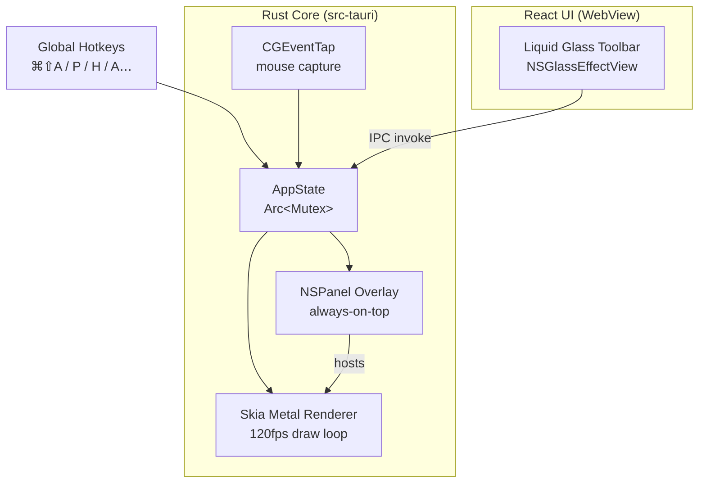

# Lumos UI/UX Redesign — Design Spec

## Goal

Replace the current placeholder toolbar UI and outdated DrawPen README with a production-grade 2026 macOS design: native Liquid Glass toolbar backed by `NSGlassEffectView`, Lucide SVG icons, grouped controls, and a fully rewritten README with badges, architecture diagram, and feature showcase.

## Scope

Two independent deliverables:
1. **Toolbar UI** — React + TypeScript + `tauri-plugin-liquid-glass`
2. **README** — Complete rewrite with Lumos branding, badges, flowcharts, feature table

---

## Part 1: Toolbar UI

### Architecture

```
┌─────────────────────────────────────┐
│  Tauri toolbar window               │
│  transparent: true                  │
│  decorations: false                 │
│  alwaysOnTop: true                  │
│  ┌───────────────────────────────┐  │
│  │  NSGlassEffectView            │  │
│  │  (tauri-plugin-liquid-glass)  │  │
│  │  cornerRadius: 100            │  │
│  │  variant: Regular             │  │
│  │  ┌───────────────────────┐    │  │
│  │  │  React webview        │    │  │
│  │  │  background: transparent│  │  │
│  │  │  Toolbar component    │    │  │
│  │  └───────────────────────┘    │  │
│  └───────────────────────────────┘  │
└─────────────────────────────────────┘
```

The glass material is rendered entirely by macOS Metal. React renders only the interactive layer on top.

### Window config (`tauri.conf.json`)

```json
{
  "label": "toolbar",
  "width": 560,
  "height": 72,
  "minWidth": 560,
  "minHeight": 72,
  "resizable": false,
  "decorations": false,
  "transparent": true,
  "alwaysOnTop": true,
  "skipTaskbar": true,
  "visible": false,
  "x": "center",
  "y": "bottom-offset-80"
}
```

Height 72px accommodates 10px top + 10px bottom pill padding + 34px button height + 2px × group padding.

Default position: **bottom center of the primary display**, 80px above the Dock.

Position is persisted via `tauri-plugin-store` after first drag. On launch, restore last known position; fall back to bottom center.

### `tauri-plugin-liquid-glass` integration

Add to `Cargo.toml`:
```toml
tauri-plugin-liquid-glass = "0.1"
```

Register in `lib.rs`:
```rust
.plugin(tauri_plugin_liquid_glass::init())
```

Apply from the toolbar window on mount:
```typescript
import { setLiquidGlassEffect } from "tauri-plugin-liquid-glass-api";

await setLiquidGlassEffect({
  cornerRadius: 100,       // full pill
  variant: "Regular",      // adaptive, most versatile
});
```

On macOS < 26, the plugin automatically falls back to `NSVisualEffectView` with `.hudWindow` material. No code change needed.

### Toolbar component structure

```
<Toolbar>                          ← pill container, data-tauri-drag-region
  <Group variant="tools">         ← tools section
    <ToolButton> × 7              ← Pen, Highlighter, Arrow, Rect, Ellipse, Laser, Eraser
  </Group>
  <Divider/>
  <Group variant="colors">        ← color section
    <ColorDot> × 5               ← Blue, Red, Green, Orange, White
  </Group>
  <Divider/>
  <Group variant="width">         ← stroke width section
    <WidthDot size={5}/>
    <WidthDot size={7}/>          ← default active
    <WidthDot size={9}/>
    <WidthDot size={11}/>
  </Group>
  <Divider/>
  <Group variant="actions">       ← utility actions
    <ActionButton icon="undo"/>
    <ActionButton icon="trash"/>
  </Group>
  <Divider/>
  <ModeChip/>                     ← Draw | Point toggle
</Toolbar>
```

### Visual spec

**Pill container** (`background: transparent` — glass is NSGlassEffectView):
- `padding: 10px 7px` (top/bottom 10px, left/right 7px)
- `border-radius: 100px`
- CSS-side specular stack (simulates system glass in webview layer):
  - `inset 0 1.5px 0 rgba(255,255,255,0.40)` — top specular
  - `inset 1px 0 0 rgba(255,255,255,0.09)` — left rim
  - `inset 0 -1.5px 0 rgba(0,0,0,0.22)` — bottom anti-specular
- `::before` — top dome radial gradient for curvature illusion
- `::after` — chromatic aberration rim: blue top-left → warm orange bottom-right

**Groups**:
- `background: rgba(255,255,255,0.04)` for tools, `rgba(255,255,255,0.03)` for colors/width/actions
- `border-radius: 100px`
- `padding: 2px 3px` (tools), `2px 7px` (colors, width)

**Dividers**:
- `1px` wide, `20px` tall
- Gradient: transparent → `rgba(255,255,255,0.18)` → transparent (fades at top and bottom)
- `margin: 0 3px`

**Tool buttons** (`<ToolButton>`):
- Size: `34 × 34px`, `border-radius: 100px`
- Icon: Lucide SVG, `16 × 16px`, `stroke-width: 2`
- Default: `color: rgba(255,255,255,0.55)`, `background: transparent`
- Hover: `color: rgba(255,255,255,0.92)`, `background: rgba(255,255,255,0.11)`, `scale(1.10)`
- Active/on: `background: rgba(255,255,255,0.17)`, `color: #fff`, `scale(0.96)`, inset shadow
- Transition: `background 0.12s`, `color 0.12s`, `transform 0.16s cubic-bezier(0.34, 1.56, 0.64, 1)`

**Icons** (Lucide, all `stroke-width: 2`, `stroke-linecap: round`, `stroke-linejoin: round`):

| Tool | Lucide icon | Hotkey |
|------|-------------|--------|
| Pen | `pencil` | P |
| Highlighter | `highlighter` | H |
| Arrow | `arrow-up-right` | A |
| Rectangle | `rectangle-horizontal` | R |
| Ellipse | `ellipse` (custom: `rx=10 ry=7`) | E |
| Laser | `zap` | L |
| Eraser | `eraser` | X |
| Undo | `undo-2` | ⌘Z |
| Clear | `trash-2` | ⌘K |

**Color dots** (`<ColorDot>`):
- Size: `12 × 12px`, `border-radius: 50%`
- Default border: `1.5px solid transparent`
- Active: `border-color: rgba(255,255,255,0.80)`, `scale(1.20)`
- Hover: `scale(1.15)`
- Colors: `#529BE0` (Blue), `#E05252` (Red), `#52E06C` (Green), `#E0A552` (Orange), `#ffffff` (White)

**Width dots** (`<WidthDot>`):
- Sizes: `5×5`, `7×7` (default), `9×9`, `11×11` px
- `border-radius: 50%`
- Default: `background: rgba(255,255,255,0.40)`
- Active: `background: #fff`, `box-shadow: 0 0 6px rgba(255,255,255,0.45)`, `scale(1.25)`

**Mode chip** (`<ModeChip>`):
- Height: `26px`, `padding: 0 12px`, `border-radius: 100px`
- Font: `10px`, `font-weight: 700`, `letter-spacing: 0.09em`, uppercase
- Draw state: `background: rgba(255,255,255,0.09)`, `color: rgba(255,255,255,0.52)`
- Point state: `background: rgba(82,224,108,0.12)`, `color: rgba(120,220,140,0.90)`
- Toggle on click, sync to Rust via `toggle_click_through` IPC command

### Files to create/modify

```
src/
├── components/
│   └── Toolbar/
│       ├── Toolbar.tsx          ← full rewrite
│       ├── Toolbar.module.css   ← new: extracted CSS classes
│       ├── ToolButton.tsx       ← rewrite: Lucide icon prop
│       ├── ColorDot.tsx         ← rename from ColorPicker, one dot
│       ├── ColorGroup.tsx       ← new: row of ColorDots
│       ├── WidthDot.tsx         ← new
│       ├── WidthGroup.tsx       ← new
│       ├── ActionButton.tsx     ← new
│       ├── ModeChip.tsx         ← new
│       └── Divider.tsx          ← new
├── hooks/
│   └── useToolbarPosition.ts   ← new: persist/restore position
└── App.tsx                     ← update to use useGlassEffect hook

src-tauri/
└── Cargo.toml                  ← add tauri-plugin-liquid-glass
```

---

## Part 2: README Rewrite

### Structure

```
1. Hero (logo + name + tagline)
2. Badges row
3. Feature GIF / screenshot
4. Feature table
5. Architecture diagram (Mermaid flowchart)
6. Tech stack
7. Keybindings table
8. Installation
9. Building from source
10. Contributing
11. License
```

### Badges

```markdown


```

### Architecture diagram (Mermaid)



### Feature table

```markdown
| Feature | Status |
|---------|--------|
| Pen / Highlighter / Arrow / Shapes / Text / Laser / Eraser | ✅ |
| Cursor effects (glow, ring, pulse, ripple) | ✅ |
| Spotlight mode (circle + rectangle) | ✅ |
| Zoom lens | ✅ |
| Global hotkeys | ✅ |
| Click-through toggle | ✅ |
| Liquid Glass toolbar (NSGlassEffectView) | ✅ |
| Multi-monitor awareness | ✅ |
| Retina / HiDPI rendering | ✅ |
| Persistent settings | ✅ |
```

### Keybindings table

```markdown
| Action | Shortcut |
|--------|----------|
| Toggle overlay | `⌘ ⇧ A` |
| Toggle draw / pointer | `⌘ D` |
| Clear all | `⌘ K` |
| Undo | `⌘ Z` |
| Pen | `P` |
| Highlighter | `H` |
| Arrow | `A` |
| Rectangle | `R` |
| Ellipse | `E` |
| Laser | `L` |
| Eraser | `X` |
| Spotlight | `⇧ S` |
| Zoom lens | `⇧ Z` |
```

---

## Self-review

**Placeholder scan:** No TBDs. All component names, CSS values, icon names, and badge URLs are fully specified.

**Internal consistency:** Window height (72px) matches pill padding (10+10) + button height (34) + group padding (2+2) + 14px total remaining = fits. NSGlassEffectView + transparent webview is consistent with Tauri transparent window config. Lucide icons specified by exact name for every tool.

**Scope:** Two focused deliverables — toolbar UI and README. Not bloated.

**Ambiguity:** `y: "bottom-offset-80"` is not a real Tauri config value — implementation should calculate `screen_height - dock_height - toolbar_height - 80` in Rust and set the window position programmatically. Clarified.
